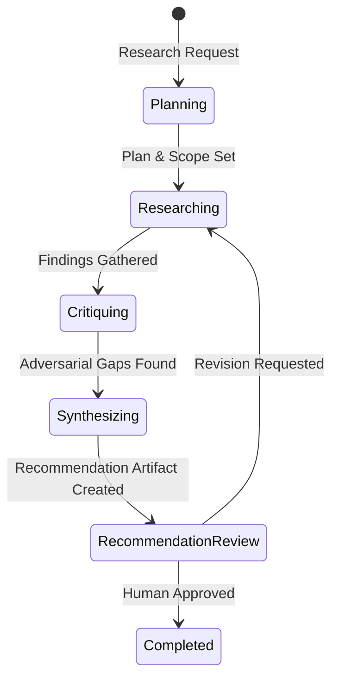

# Agentic Graph Engineering Vision & Research Skill Specification

## Executive Summary & Monorepo Vision

StartBuilding is a methodology and cross-client plugin framework for **Human-in-the-Loop Agentic Graph Engineering**. It structures complex software development tasks into resumable, file-backed state machines executed by specialist LLM agents with least-privilege tool access boundaries.

Rather than fragmenting StartBuilding into separate repositories per workflow, this repository serves as a **monorepo for agentic software engineering graph skills**. Maintaining multiple skills (such as `/deliver` and `/research`) in a single repository provides key benefits:

1. **Shared Static Validation & Tooling**: Reuses static validation tools (`scripts/validate.sh`, `scripts/validate.py`) and cross-client plugin packaging (`plugin.json`, `.plugin/plugin.json`, `.claude-plugin/plugin.json`).
2. **Unified Product Identity**: Provides developers with a cohesive toolkit for human-in-the-loop agent workflows in VS Code, GitHub Copilot, and Claude Code.
3. **Reusable Design Contracts**: Standardizes file-backed run state logging, human approval gates, and specialist agent isolation patterns across all skills.

---

## The `/research` Skill Graph

While `/deliver` focuses on software execution, code editing, and PR delivery, `/research` is a discovery and decision-making graph. It investigates complex technical problems, searches codebases or external context, subjects hypotheses to adversarial critique, and synthesizes a structured recommendation for human review.



### Roles and Specialist Agents

| Agent / Role | Primary Responsibility | Copilot Tools | Claude Tools |
| --- | --- | --- | --- |
| **Research Coordinator** | Manages run state, orchestrates step execution, handles user interaction | `read`, `search`, `edit`, `execute`, `agent` | `Read`, `Glob`, `Grep`, `Write`, `Edit`, `Bash`, `Agent` |
| **Researcher** | Investigates target codebase/problem, collects evidence, documents findings | `read`, `search` | `Read`, `Glob`, `Grep` |
| **Skeptic** | Adversarial reviewer; challenges assumptions, identifies risks and edge cases | `read`, `search` | `Read`, `Glob`, `Grep` |
| **Merger** | Synthesizes researcher evidence and skeptic critiques into a structured recommendation | `read`, `search` | `Read`, `Glob`, `Grep` |

All specialist sub-agents (`researcher`, `skeptic`, `merger`) are strictly **read-only** to ensure isolation and prevent unintended mutations during the research phase.

---

## State Machine & Artifact Contracts

### State Transitions

1. **`planning`**: Defines the research goal, scope, and key questions.
2. **`researching`**: The `Researcher` agent gathers facts, codebase references, and architectural evidence.
3. **`critiquing`**: The `Skeptic` agent reviews researcher outputs to find flawed assumptions, unaddressed edge cases, or missing data.
4. **`synthesizing`**: The `Merger` agent combines the evidence and critique into a comprehensive `recommendation.md` artifact.
5. **`recommendation_review`**: The coordinator presents the recommendation to the human user for review, feedback, or approval.
6. **`completed`**: The research run concludes upon human sign-off.

### Directory & File Structure

```text
skills/
  deliver/                              Existing software delivery skill
  research/                             New research skill graph
    SKILL.md                            Main entry point and coordinator prompt
    assets/
      research-project.json
    references/
      artifact-contract.md             Schema for research run artifacts
      workflow-stages.md               State transition and gate rules

agents/
  # Existing Deliver Agents
  startbuilding-coordinator.agent.md
  startbuilding-planner.agent.md
  startbuilding-implementer.agent.md
  startbuilding-reviewer.agent.md
  startbuilding-committer.agent.md

  # Proposed Research Agents
  startbuilding-research-coordinator.agent.md
  startbuilding-researcher.agent.md
  startbuilding-skeptic.agent.md
  startbuilding-merger.agent.md
```

### Run Artifacts Layout

Run artifacts are stored in `.startbuilding/runs/<run-id>/` (shared workspace directory ignored by Git):
- `run.json`: Run state metadata (current stage, active plan, timestamp).
- `research-plan.md`: Initial research scope and questions.
- `findings.md`: Evidence collected by the Researcher.
- `critique.md`: Counterpoints and risk analysis by the Skeptic.
- `recommendation.md`: Final synthesized proposal presented for human approval.

---

## Implementation Checklist for the Next Engineer

- [ ] **1. Create Skill Definition**:
  - Add `skills/research/SKILL.md` defining the research workflow entry point.
  - Add reference documentation in `skills/research/references/`.
- [ ] **2. Create Specialist Agent Definitions**:
  - `agents/startbuilding-research-coordinator.agent.md`
  - `agents/startbuilding-researcher.agent.md`
  - `agents/startbuilding-skeptic.agent.md`
  - `agents/startbuilding-merger.agent.md`
- [ ] **3. Update Plugin Manifests**:
  - Update `plugin.json`, `.plugin/plugin.json`, `.claude-plugin/plugin.json`, and `.claude-plugin/marketplace.json` if required.
- [ ] **4. Validation & Testing**:
  - Update `scripts/validate.py` to recognize new research agent definitions and ensure tool allowlists conform to safety constraints.
  - Run `./scripts/validate.sh` and `claude plugin validate . --strict`.
